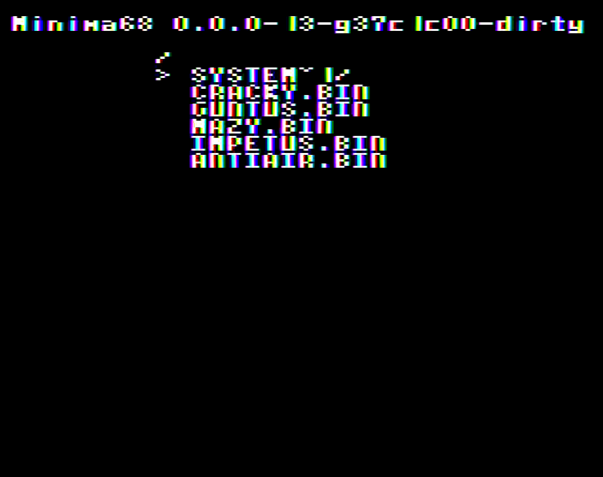

# Minima68

 [MachiKania type PU](http://www.ze.em-net.ne.jp/~kenken/machikania/typepu.html)のハードウェアで動作する、架空の8ビット機のエミュレーターです。

## 仕様

* CPU: MC6800 1MHz相当
* RAM: 52kバイト
* 画面解像度: 128x208ドット (32x26文字)
* 色数: 16色
* スプライト: 8x16ドット/最大32個（水平方向16個）
* サウンド: トーン3チャンネル+ノイズ1チャンネル

メモリマップ等の技術情報は[technical.md](technical.md)をご覧ください。

## 使い方

### インストール

### Raspberry Pi Pico

minima68.zipを展開し、pico/Minima68.uf2をRaspberry Pi Picoに書き込みます。

### Raspberry Pi Pico2

minima68.zipを展開し、pico2/Minima68.uf2をRaspberry Pi Pico2に書き込みます。

### 起動

設定ファイル(MINIMA68.INI)とプログラムファイル（拡張子 .BIN）を入れたSDカードを挿して電源を接続します。

画面にプログラムファイル名が表示されるので、矢印キー↑↓で選択しスペースキー(またはZ)を押して実行します。



## 設定ファイル

MINIMA68.INIに以下の設定を記述できます。（現時点ではキーボード種別のみ設定可能です）

|項目|内容|
|-|-|
|106KEY|JIS配列キーボードを使用(キーボード設定を省略した場合はこちら)|
|101KEY|US配列キーボードを使用|

## Windows版

Windows版もあります。

minima68.zipを展開し、windows/Minima68.exeを実行してください。
[Visual C++ランタイム](https://aka.ms/vc14/vc_redist.x64.exe)が必要です。


## ビルド方法

### 必要なもの

* CMake 3.20以上
* **Pico向け**: Ninja、ARM GCC ツールチェーン（Pico SDK は初回ビルド時に自動取得）
* **Windows向け**: Visual Studio 2026

### Raspberry Pi Pico向けビルド

VS Code のタスク（**Ctrl+Shift+B**）からビルドできます。

コマンドラインからビルドする場合は以下の手順で行います。

#### Releaseビルド

```bash
cmake --preset pico-release
cmake --build --preset pico-release
```

出力ファイル: `build/pico-release/platforms/pico/Minima68.uf2`

#### Debugビルド

```bash
cmake --preset pico
cmake --build --preset pico
```

出力ファイル: `build/pico/platforms/pico/Minima68.uf2`

### Raspberry Pi Pico2向けビルド

VS Code のタスク（**Ctrl+Shift+B**）からビルドできます。

コマンドラインからビルドする場合は以下の手順で行います。

#### Releaseビルド

```bash
cmake --preset pico2-release
cmake --build --preset pico2-release
```

出力ファイル: `build/pico2-release/platforms/pico/Minima68.uf2`

#### Debugビルド

```bash
cmake --preset pico2
cmake --build --preset pico2
```

出力ファイル: `build/pico2/platforms/pico/Minima68.uf2`


### Windows向けビルド

CMakeプリセット `windows-x64-release`（または `windows-x64-debug`）を使用します。Visual Studio 2026 でビルドしてください。
