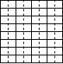
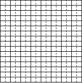

# メモリマップ

|アドレス|内容|
|-|-|
|$0000-$CFFF|RAM|
|$D000-$DFFF|タイルパターン|
|$E000-$EFFF|スプライトパターン|
|$F000-$F7FF|タイルマップ(VRAM)|
|$F800-$F87F|スプライトアトリビュート|
|$FF00-$FF2F|カラーパレット|
|$FF30-$FFF7|I/O領域|
|$FFF8-$FFFF|割り込み/リセットベクター(RAM)|

# I/O詳細

## ビデオ

### タイルパターン

タイルパターンは4×8ドットです。
1バイトあたり2ドット、上位4ビットが左側になります。

### スプライトパターン

スプライトパターンは8×16ドットです。
1バイトあたり2ドット、上位4ビットが左側になります。

### タイルマップ

ページ1つあたり32×26文字を表示できます。

ページ0: $F000
ページ1: $F400

### スプライトアトリビュート

アドレス: $F800-$F87F

スプライト1つあたり4バイトです。

|オフセット|内容|
|-|-|
|0|Y座標|
|1|X座標|
|2|スプライトパターン番号(0-255)|
|3|未使用|

### カラーパレット

アドレス: $FF00-$FF2F

B、R、Gそれぞれ1バイトの輝度を16色分設定できます。

### 表示ページ

アドレス: $FF30

表示ページを設定します。
bit0=0でページ0、bit0=1でページ1を表示します。

## サウンド

### トーン音源

#### トーン周波数

トーンの周波数を設定できます。上位バイト、下位バイトの順です。

|アドレス|内容|
|-|-|
|$FF40-$FF41|チャンネル0|
|$FF42-$FF43|チャンネル1|
|$FF44-$FF45|チャンネル2|

#### トーン音量

トーンの音量を設定できます。最大値は63です。

|アドレス|内容|
|-|-|
|$FF46|チャンネル0|
|$FF48|チャンネル1|
|$FF4A|チャンネル2|

### ノイズ音源

#### ノイズ周波数

アドレス: $FF4C

ノイズの周波数を設定できます。上位バイト、下位バイトの順です。

#### ノイズ音量

アドレス: $FF4E

ノイズの音量を設定できます。最大値は63です。

## 入力

### ジョイスティック

アドレス: $FF80

コントロールボタンの状態を読み取ることができます。

|ビット|内容|
|-|-|
|0|←|
|1|→|
|2|↑|
|3|↓|
|4|FIRE|
|5|START|

キーボードでも操作できます。

|キー|機能|
|-|-|
|矢印キー←|←|
|矢印キー→|→|
|矢印キー↑|↑|
|矢印キー↓|↓|
|Z|FIRE|
|X|START|
|SPACE|FIRE|
|ENTER|START|

### キーボード

アドレス: $FF81

キーボードから入力された文字コードを読み取ることができます。
何も入力されていなければ、値は$00になります。

# 実行ファイル要件

* 拡張子はBINにしてください。
* 開始アドレスは$0100固定です。
ファイルがロードされた後、リセットベクターに$0100が書き込まれCPUがリセットされます。